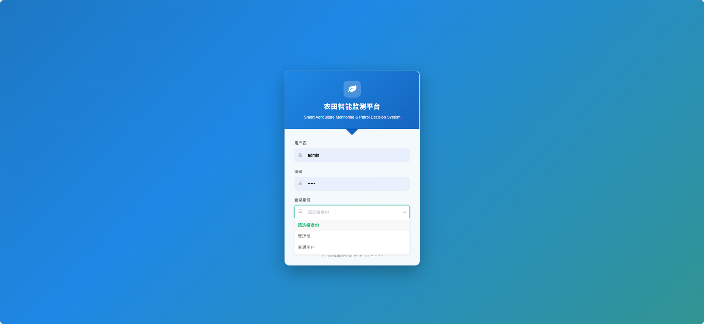
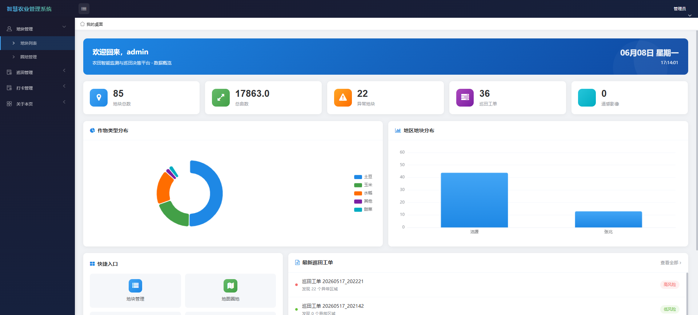
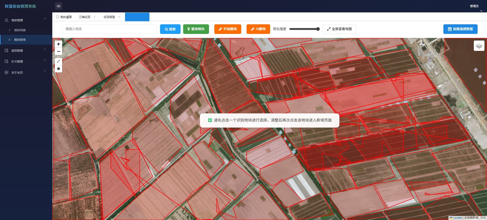
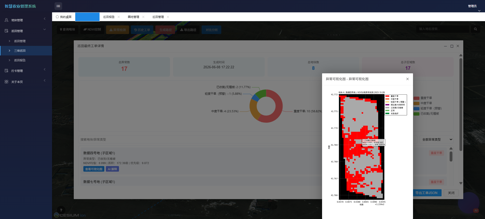
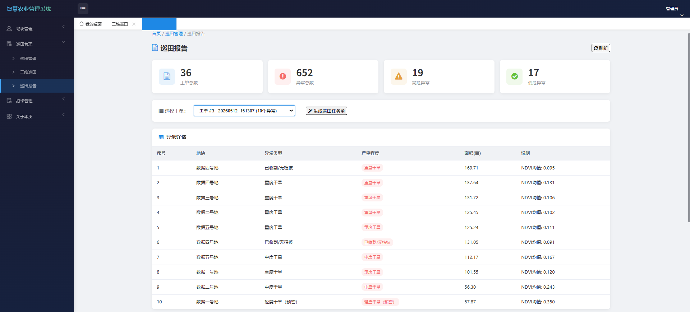
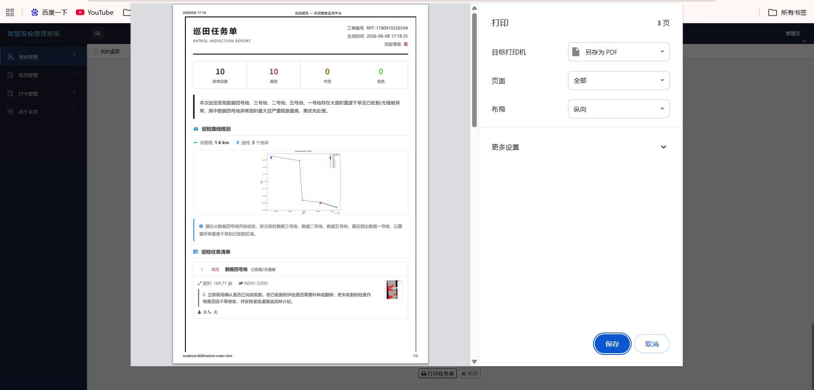
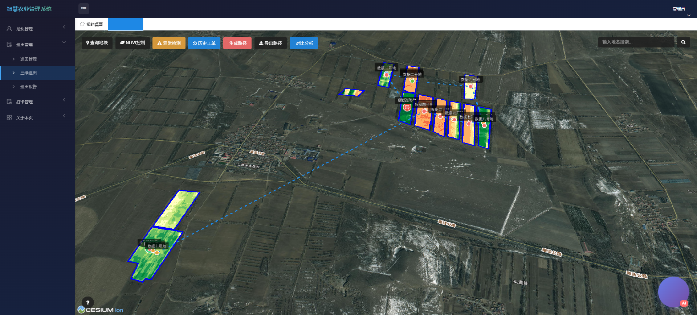
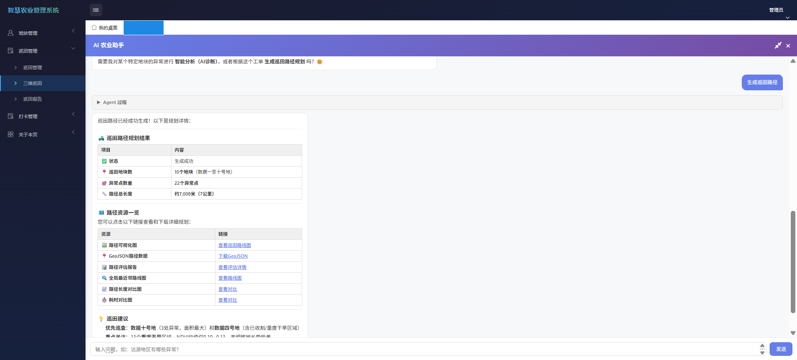

# 智慧农业遥感监测与巡田决策平台

面向精准农业的一站式管理系统，集成地块全生命周期管理、多源遥感影像分析、AI 智能诊断与巡田路径规划，实现从卫星数据采集到田间决策执行的完整业务闭环。

## 系统架构

采用 **"Java 业务层 + Python 计算层 + 前端可视化层"三层分离架构**：

```
┌─────────────────────────────────────────────────────────┐
│                   前端可视化层                            │
│   Cesium 3D 地球 · Leaflet 2D 地图 · ECharts · LayUI    │
├─────────────────────────────────────────────────────────┤
│                   Java 业务层 (Spring Boot :8080)         │
│   用户认证(JWT) · 地块CRUD · 巡田管理 · AI Agent 调度     │
├─────────────────────────────────────────────────────────┤
│                   Python 计算层 (Flask :8000)             │
│   GDAL 影像裁剪 · NDVI 异常检测 · 子区域分析 · 路径规划   │
└─────────────────────────────────────────────────────────┘
```

## 功能展示
### 登陆界面


### 数据驾驶舱


### 地图圈地


### 异常检测


### 巡田报告


### 巡田任务单


### 路径规划


### AI 农业助手


## 技术栈

| 层级 | 技术 |
|------|------|
| 后端 | Spring Boot 2.6 · Spring Data JPA · MyBatis-Plus · JWT · OkHttp |
| 计算 | Python 3 · Flask · GDAL · GeoTIFF |
| 前端 | Leaflet · Cesium 3D · ECharts · LayUI · SSE |
| AI | DeepSeek LLM · ReAct Agent · Function Calling |
| 数据 | MySQL · JSON 空间数据 |

## 核心模块

### AI Agent 服务
基于 ReAct（Reasoning + Acting）模式的智能助手框架：
- 工具自动注册：Spring DI 自动发现 `AgentTool` 实现类，运行时动态注册 5 个工具
- 流式推理链：SSE 实时输出思考过程、工具调用状态、最终回答
- 多轮对话：ConcurrentHashMap 维护会话历史，支持上下文连续对话
- 异常降级：参数解析失败降级为空对象、LLM 畸形 JSON 自动过滤

### 遥感数据处理
- GDAL 按地块矢量边界动态裁剪 GeoTIFF 卫星影像
- NDVI / EVI / SAVI / NDWI 多光谱指数计算
- 子区域分级分析（重度/中度/轻度异常）
- 异步任务机制，前端轮询获取进度

### 巡田路径规划
- 分层最近邻算法：先按地块质心规划大路线，再规划异常点巡检顺序
- 2-opt 局部优化，提升路径质量
- 生成 GeoJSON 路径 + PNG 路径图 + 量化评估报告

### 空间可视化
- Cesium 3D 地球：地块三维渲染、NDVI 热力图、异常标注、AI 聊天嵌入
- Leaflet 2D 地图：地块圈选编辑（Leaflet.draw）、坐标拾取
- ECharts 图表：作物分布饼图、地区分布柱状图、异常统计

## 项目结构

```
smart-agriculture-management/
├── src/main/java/com/example/smartAgr/
│   ├── config/                     # 配置类（LLM、CORS、JWT）
│   ├── controller/admin/           # 管理端接口
│   │   ├── AgentController.java    # AI Agent 对话
│   │   ├── DashboardController.java# 数据驾驶舱
│   │   └── ReportController.java   # 巡田报告
│   ├── service/ai/                 # AI 核心服务
│   │   ├── AgentService.java       # ReAct 循环引擎
│   │   └── tools/                  # 5 个内置工具
│   └── interceptor/                # JWT 拦截器
│
├── src/main/resources/
│   ├── application.yml             # 应用配置
│   └── static/                     # 前端页面
│       ├── admin-patrol-cesium.html# 3D 地球 + AI 助手
│       ├── admin-patrol.html       # 巡田规划（Leaflet 2D）
│       ├── admin-report.html       # 巡田报告
│       ├── welcome.html            # 数据驾驶舱
│       └── css/                    # 样式文件
│
├── api/                            # Python Flask 微服务
│   ├── app.py                      # Flask 主应用
│   ├── xuntian_subregion.py        # 子区域异常分析
│   └── services/patrol_planning.py # 路径规划算法
│
├── photos_png/                     # 系统截图
├── docs/                           # 开发文档
└── pom.xml
```

## 快速开始

### 环境要求
- JDK 1.8+ · Maven 3.6+ · MySQL 5.7+ · Python 3.8+

### 1. 数据库
```bash
mysql -u root -p -e "CREATE DATABASE mydb;"
mysql -u root -p mydb < src/main/resources/mydb.sql
```

### 2. 配置
编辑 `src/main/resources/application.yml`，配置数据库连接和 LLM API Key：
```yaml
spring:
  datasource:
    username: root
    password: your_password

llm:
  api-key: ${LLM_API_KEY:your-api-key-here}
```

或通过环境变量设置：
```bash
export LLM_API_KEY=sk-xxx
```

### 3. 启动 Java 后端
```bash
./mvnw spring-boot:run
```

### 4. 启动 Flask 微服务
```bash
cd api
pip install -r requirements.txt
python app.py
```

### 5. 访问
- 地址：http://localhost:8080/
- 管理员：`admin` / `admin`

## API 接口

| 接口 | 方法 | 说明 |
|------|------|------|
| `/admin/ai/chat/stream` | POST | SSE 流式 AI 对话 |
| `/admin/dashboard/overview` | GET | 驾驶舱概览数据 |
| `/admin/plots` | GET/POST | 地块 CRUD |
| `/admin/llm/explain` | POST | 异常智能分析 |

## 已知限制

- Agent 会话存储在内存中，重启丢失
- 分页为内存分页，大数据量需优化


## 开发工具

- **IDE**: IntelliJ IDEA
- **AI 辅助**: Claude Code
- **版本控制**: Git
